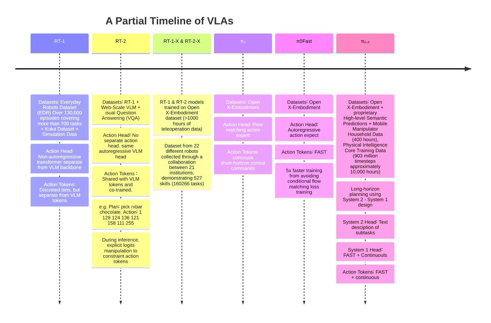

### Introduction

This post contains my personal notes on the π₀.₅ model from Physical Intelligence. Recently, I started working on a project that involved fine-tuning the π₀.₅ model for a robotic pick-and-place task. Vision language action models (VLAs) are quite complex, incorporating elements from various neural network and robotic paradigms, including large language models (LLMs), vision language models (VLMs), flow matching, autoregressive token prediction, tokenizers, short-horizon action generation, and long-horizon task planning, to name a few. This post covers all of these components in just enough depth to understand their usage in the π₀.₅ model. Since my project focuses on fine-tuning the model on a UR5 arm fitted with a two-finger Robotiq gripper, I spent a lot of time working with the π₀.₅ version open-sourced by Physical Intelligence. As a result, I will highlight the differences between the full model described in the paper and the slightly limited open-source release.

<p style="text-align:center;">⚠️ <b>This is a living document</b></p>

### Timeline

I will start this section with a big disclaimer. The timeline presented does not reflect the actual history of VLAs. For example, I am glossing over many significant VLAs. [This repository](https://github.com/yueen-ma/awesome-vla) does a great job of keeping track of the full VLA history and current developments. Instead, the timeline I present covers the models and datasets that were significant evolutionary steps in the creation of the π₀.₅ model.



π₀.₅ is undoubtedly a significant advancement in robotics, particularly for long-horizon tasks. While π₀.₅ incorporates many innovations, it also borrows heavily from the followig models.

**RT-1**

```typograms
task specific specialized models ──▶ task-agnostic low-level controller
```

RT1 architecturally resembles most VLM architectures. In fact, up until the transformer block that generates action tokens, there are no differences from any generic VLM model at all. It tokenizes multimodal inputs and generates embeddings that encapsulate all information contained in the inputs using self-attention. This part is the same as any encoder module in LLMs/VLMs. However, unlike LLMs/VLMs, RT1 does not have a cross-attention-based decoder that autoregressively generates the next output token. Instead, it uses an action token generation transformer module that generates 11-dimensional action tokens corresponding directly to the control commands. This is also the major robotics-specific architectural innovation introduced by RT1. Robotic actions are continuous control commands. LLMs/VLMs are trained with discrete tokens using cross-entropy loss. RT1 stuck with the same discrete tokens and the same training scheme by discretizing continuous control commands into discrete bins. Here is an excerpt from the RT1 paper explaining the process.

<p style="text-align:center;"><b><em>❝ To tokenize actions, each action dimension in RT-1 is discretized into
256 bins. As mentioned previously, the action dimensions we consider include seven variables
for the arm movement (x, y, z, roll, pitch, yaw, opening of the gripper), three variables for base
movement (x, y, yaw) and a discrete variable to switch between three modes: controlling arm, base
or terminating the episode. For each variable, we map the target to one of the 256 bins, where the
bins are uniformly distributed within the bounds of each variable. ❞</em></b></p>

RT1 aimed for 3HZ control frequency, which means the inference time of RT1 should take less than 100ms and is designed to act as the low-level controller (System 1, but more on that later).
Thus, models like

**RT-2**

```typograms
task-agnostic VLA trained on robotic data ──▶ task-agnostic VLA co-trained on robotic data + web data
```

RT2's architecture was shaped by one primary goal: How can web-scale data be leveraged for training? Since RT1's training data is focused on robotic data, it does not benefit from the plentiful web-scale — although non-robotic — data. The major limiting factor in RT-1's architecture is that the action head and action tokens are added on top of the VLM backbone, and the action tokens are not related to the tokens VLM models are trained on. To address this, RT-2 selects a few VLM tokens for action tokens. The exact tokens selected depend on the VLM model, and the model is co-trained on both typical VLM tasks and robotic tasks.

<p style="text-align:center;"><b><em>❝ The two VLMs that we finetune in our experiments, PaLI-X and PaLM-E, use
different tokenizations. For PaLI-X, integers up to 1000 each have a unique token, so we simply
associate the action bins to the token representing the corresponding integer. For the PaLM-E model,
which does not provide this convenient representation of numbers, we simply overwrite the 256 least
frequently used tokens to represent the action vocabulary. 
❞</em></b></p>
Let's look at a couple of prompt and model reponse from  RT-2.

```text
Prompt: Given  Instruction: Bring me a drink.
------------------------------
Prediction: Plan: pick 7up can. Action: 1 143 129 123 145 114 115 127
```

```text
Prompt:
Given  Instruction: Move all the objects together.
------------------------------
Prediction: Plan: move green can near green rice chip bag. Action: 1 128 126 127 135 123 119 127
```

So, the model generates a plan and an action in response to the prompt autoregressively. Each of the plan and action responses contains the tokens 'plan' and 'action' at the beginning. The plan part of the response is trained using the standard visual question-answering (VQA) scheme, and the action part is the same as in RT-1. The major difference is the token sharing, which, as the authors claim, helps the action head benefit from the knowledge contained in the VLM backbone.

---

```typograms
small-scale robotic data + web data ──▶  large-scale robotic data
```

**RT-1-X & RT-2-X**

RT-1-X and RT-2-X are not really milestones in terms of their architecture. In fact, they are exactly the same models as RT-1 and RT-2, respectively. The real milestone is the creation of the Open X-Embodiment dataset — a dataset from 22 different robots, collected through a collaboration between 21 research institutions across the globe, demonstrating 527 skills (160,266 tasks) and featuring over 1,000 hours of teleoperation data. RT-1-X and RT-2-X are RT-1 and RT-2 models trained on Open X-Embodiment, respectively.

**π₀**

```typograms
discrete action tokens          continuous action chunks
          +               ──▶            +
   autogressive head               flow mathcing head
```

π₀ represents a significant architectural shift away from autoregressive action heads and discrete action tokens. It introduces three main innovations.

1. Flow matching-based action head
2. Action chunks (short-horizon) instead of next action
3. Continuous control commands instead of discrete action tokens

<div class="row">
    <div class="col-sm mt-3 mt-md-0">
        
    </div>
</div>
<div class="caption">
π₀ architecture. Source: <a href="https://www.pi.website/blog/pi0"> Physical Intelligence π₀ blog</a> 
</div>

Discrete action tokens used by RT family of models introduces discretization artifacts and limits control frequency. Flow matching treats actions as continuous values, enabling the 50Hz frequency required for dexterous tasks. Instead of predicting one token at a time, π₀ uses flow matching to generate entire "action chunks" simultaneously. Flow matching is discuss in the [background section](#Background) in detail.

**π₀ FAST**

```typograms
short horizon continuous action chunks                 FAST Tokens
          +                                   ──▶         +
    flow mathcing head                               autogressive head
```

The continuous action chunks enabled π₀ to act as a high-frequency, low-level controller. However, training the flow-matching action head is slower than training for discrete tokens autoregressively. Also, control commands do not change much between time steps in an action chunk. This repetitiveness can be exploited to good effect.

The FAST (Frequency-space Action Sequence Tokenization) tokenizer converts high-frequency continuous action chunks into a dense, discrete vocabulary compatible with standard transformers. It first uses the Discrete Cosine Transform (DCT) to compress time-series robot data into the frequency domain, capturing the essence of motion with fewer variables. These frequency coefficients are then compressed via Byte Pair Encoding (BPE). This multi-step process allows the model to treat 50Hz motor control as a compact discrete tokens enabling efficient autoregressive training without the precision loss typically found in simple coordinate binning.

<div class="row">
    <div class="col-sm mt-3 mt-md-0">
        
    </div>
</div>
<div class="caption">
FAST Tokenization. Source: <a href="https://www.pi.website/research/fast  "> Physical Intelligence FAST blog</a> 
</div>

**π₀.₅**

```typogramsF
  FAST Tokens                      Intermediate FAST + Continuous actions
     +                ──▶                            +
autogressive head                  Hybrid (autogressive + flow-matching)
```

π₀.₅ scales the original π₀ architecture to handle long-horizon tasksby merging the "thinking" speed of VLMs with the "doing" precision of flow matching.

1.  System 1 vs. System 2 Design <br>
    - System 2 (Slow/Reasoning): The large VLM backbone handles high-level semantic reasoning and planning. It processes instructions and visual context to decide "what" to do next (e.g., "I need to put the cup in the dishwasher").
    - System 1 (Fast/Reactive): A smaller, specialized Action Expert handles low-level motor execution. It focuses on the "how" (e.g., the micro-adjustments needed to grip the handle at 50Hz).

2.  Hybrid Training (FAST + Continuous) <br>
    π₀.₅ uses a multi-objective training strategy to achieve Knowledge Insulation:
    - FAST Tokens: During training, the model predicts discrete FAST tokens. This provides a stable, "language-like" gradient that allows the model to learn motor tasks without overwriting or "corrupting" the pre-trained semantic knowledge in the VLM backbone.
    - Continuous Flow Matching: Simultaneously, the model trains on continuous action objectives. This ensures the model retains the high-fidelity control necessary for delicate physical interactions.

3.  Hybrid Action Expert (Autoregressive + Flow Matching) <br> The "Action Expert" head is a hybrid module that bridges the gap between discrete planning and continuous execution:
    - Autoregressive Component: Used for high-level "sub-goal" prediction or "chain-of-thought" actions. It predicts tokens that define the intent of the action chunk.
    - Flow Matching Component: Takes those high-level features and "paints" the actual continuous trajectory. This is more efficient for real-time inference because it avoids the latency of generating dozens of tokens one-by-one at 50Hz.
4.  Long-Horizon PerformanceBy separating reasoning from execution <br> π₀.₅ can maintain focus over tasks spanning several minutes. The System 2 backbone manages the sequence of sub-tasks (the "horizon"), while the Hybrid Expert ensures each individual sub-task is executed with the dexterity of a continuous control model.

<div class="row">
        <div class="col-sm mt-3 mt-md-0">
            
        </div>
</div>
<div class="caption">
Co-training tasks in π₀.₅. Source: <a href="https://www.pi.website/blog/pi05"> Physical Intelligence π₀.₅ blog</a> 
</div>

<div class="row">
    <div class="col-sm mt-3 mt-md-0">
        
    </div>
</div>
<div class="caption">
High-level/low-level inference procedure used by π₀.₅. Source: <a href="https://www.pi.website/blog/pi05"> Physical Intelligence π₀.₅ blog</a> 
</div>

<div class="row justify-content-center">
    <div class="col-sm-9 mt-3 mt-md-0">
        
    </div>
</div>
<div class="caption">
   System 2 + System 1 design. Source: <a href="https://robot-learning-collective.github.io/winning-behavior-1k-challenge.html"> Ilia Larchenko</a> 
</div>

The training of π₀.₅ for long-horizon planning relies on a strategy called co-training on heterogeneous data. This approach allows the model to learn high-level semantic reasoning from non-robotic data while learning precise physical control from specialized robot demonstrations.The primary datasets and sources used include:

- Mobile Manipulation Data (400+ Hours): A medium-sized, high-quality dataset collected directly from mobile manipulators in dozens of diverse, real-world homes. This provides the primary foundation for complex tasks like cleaning a kitchen or making a bed."High-Level"
- Semantic Examples: Observations paired with semantic behavior labels (e.g., an image of a messy room labeled "pick up the pillow"). This teaches the model the logical "next step" in a multi-stage process.
- Verbal Instruction (VI) Demonstrations: Data from expert human supervisors who coach the robot through tasks step-by-step using natural language. This specific dataset is crucial for training the "System 2" ability to predict appropriate subtasks.
- Web Data: Standard vision-language datasets (image captioning, VQA, and object localization) are included throughout training to preserve the model's general semantic knowledge and reasoning capabilities.
- Open X-Embodiment dataset

By mixing high-level planning labels with low-level physical demonstrations, π₀.₅ learns to execute complex multi-stage behaviors that can last between 10 and 15 minutes in entirely unseen environments

### Finetuning π₀.₅

While the results of π₀.₅ are impressive, are impressive, the model is only partially (no high-level task planning head & no intermediate FAST action expert) open-sourced and most of the datasets used to train it are also proprietary. The Hugging Face community is doing a great job of recreating this popular VLA. Here are [offical π₀.₅](https://github.com/Physical-Intelligence/openpi#finetuning-with-pytorch) & [huggingface](https://huggingface.co/docs/lerobot/pi05?_sm_vck=P31sV0jLqjnQFsR3K67KNQ6KZHZZRvQMnHPvkDFHk2P30KPZ4ZbJ#training-command-example) instructions to finetune π₀.₅ (only the continous action expert) on custom dataset.

### Background

**SigLIP**

CLIP (Contrastive Language–Image Pretraining), introduced by OpenAI, is a model that learns visual representations by aligning images and text in a shared embedding space. It is trained on large-scale image-text pairs using a symmetric cross-entropy loss over cosine similarities. Given a batch of N image-text pairs, CLIP computes a similarity matrix and maximizes the similarity of correct pairs while minimizing incorrect ones. The loss for images is:

$$
    \mathcal{L}_{\text{CLIP}} = -\frac{1}{N} \sum_{i=1}^{N} \log
    \frac{\exp(\text{sim}(\mathbf{v}_i, \mathbf{t}_i) / \tau)}
         {\sum_{j=1}^{N} \exp(\text{sim}(\mathbf{v}_i, \mathbf{t}_j) / \tau)}
$$

where $\text{sim}(⋅,⋅)$ denotes cosine similarity and $\tau$ is a learnable temperature parameter. The total loss is the average of the image-to-text and text-to-image directions.

SigLIP (Sigmoid Loss for Language–Image Pretraining), introduced by Google, replaces CLIP's softmax-based contrastive loss with a sigmoid loss, treating each image-text pair independently as a binary classification problem. This removes the dependency on in-batch negatives and allows more stable training with smaller batch sizes. The SigLIP loss is defined as:

$$
\mathcal{L}_{\text{SigLIP}} = -\frac{1}{N^2} \sum_{i=1}^{N} \sum_{j=1}^{N}
    \log \sigma\!\left(z_{ij} \cdot \left(2 \cdot \mathcal{1}[i=j] - 1\right)\right)
$$

where $\sigma(⋅)$ is the sigmoid function, $ z\_{ij} = \text{sim} (v_i, v_j)/ \tau $ is the scaled similarity score, and $\mathcal{1}[i=j]$ is 1 for positive pairs and 0 for negatives. This formulation encourages positive pairs to have high sigmoid outputs and negative pairs to have low ones, independently of one another.

**Flow matching**


<div class="caption">
Source: <a href="https://peterroelants.github.io/posts/flow_matching_intro">Peter Roelants' excellent blog</a>
</div>

Diffusion models and flow matching are two powerful frameworks for generative modeling that learn to transform a simple noise distribution into a complex data distribution. Diffusion models operate by defining a forward process that gradually corrupts data $x_0$ with Gaussian noise over $T$ timesteps, and then learning a reverse process to denoise it. The forward process is defined as:

$$
    q(\mathbf{x}_t | \mathbf{x}_0) = \mathcal{N}\!\left(\mathbf{x}_t;\,
    \sqrt{\bar{\alpha}_t}\,\mathbf{x}_0,\, (1 - \bar{\alpha}_t)\mathbf{I}\right)


$$

where $\bar{\alpha}_t$ is a Cumulative signal retention factor (how much of the original signal $\mathbf{x}_0$ is retained at time $t$). The model is trained to predict the noise ϵ added at each step via:

$$

    \mathcal{L}_{\text{diff}} = \mathbb{E}_{t,\, \mathbf{x}_0,\, \boldsymbol{\epsilon}}
    \left[\|\boldsymbol{\epsilon} - \boldsymbol{\epsilon}_\theta(\mathbf{x}_t, t)\|^2\right]


$$

Flow matching instead learns a vector field $\mathbf{v}_\theta(\mathbf{x}, t)$ governed by an ODE:

$$

    \frac{d\mathbf{x}}{dt} = \mathbf{v}_\theta(\mathbf{x}, t)


$$

with linear interpolation $\mathbf{x}_t = (1-t)\,\mathbf{x}_0 + t\,\mathbf{x}_1$
and trained using the Conditional Flow Matching objective:

$$

    \mathcal{L}_{\text{CFM}} = \mathbb{E}_{t,\, \mathbf{x}_0,\, \mathbf{x}_1}
    \left[\|\mathbf{v}_\theta(\mathbf{x}_t, t) - (\mathbf{x}_1 - \mathbf{x}_0)\|^2\right]


$$

During inference, flow matching generates samples by numerically solving an ODE that transports a noise sample from the source distribution $p_0$ to the data distribution $p_1$. Since we cannot solve this ODE analytically, we use Euler integration — one of the simplest numerical ODE solvers — to approximate the solution step by step.

Step 1: Start with a noise sample drawn from the source distribution:

$$
\mathbf{x}_0 \sim p_0 = \mathcal{N}(\mathbf{0}, \mathbf{I})
$$

Step 2: Define a uniform time grid with $N$ steps between $t=0$ and $t=1$:

$$
\Delta t = \frac{1}{N}, \quad t_n = \frac{n}{N}, \quad n = 0, 1, \dots, N-1
$$

Step 3: At each timestep $t_n$, query the learned vector field and take a small Euler step

$$
\mathbf{x}_{t_{n+1}} = \mathbf{x}_{t_n} + \Delta t \cdot \mathbf{v}_\theta(\mathbf{x}_{t_n}, t_n)
$$

Step 4: After $N$ steps, the final sample $\mathbf{x}_1$ is the generated data point:

$$
\mathbf{x}_1 \approx \mathbf{x}_0 + \sum_{n=0}^{N-1} \Delta t \cdot \mathbf{v}_\theta(\mathbf{x}_{t_n}, t_n)
$$
