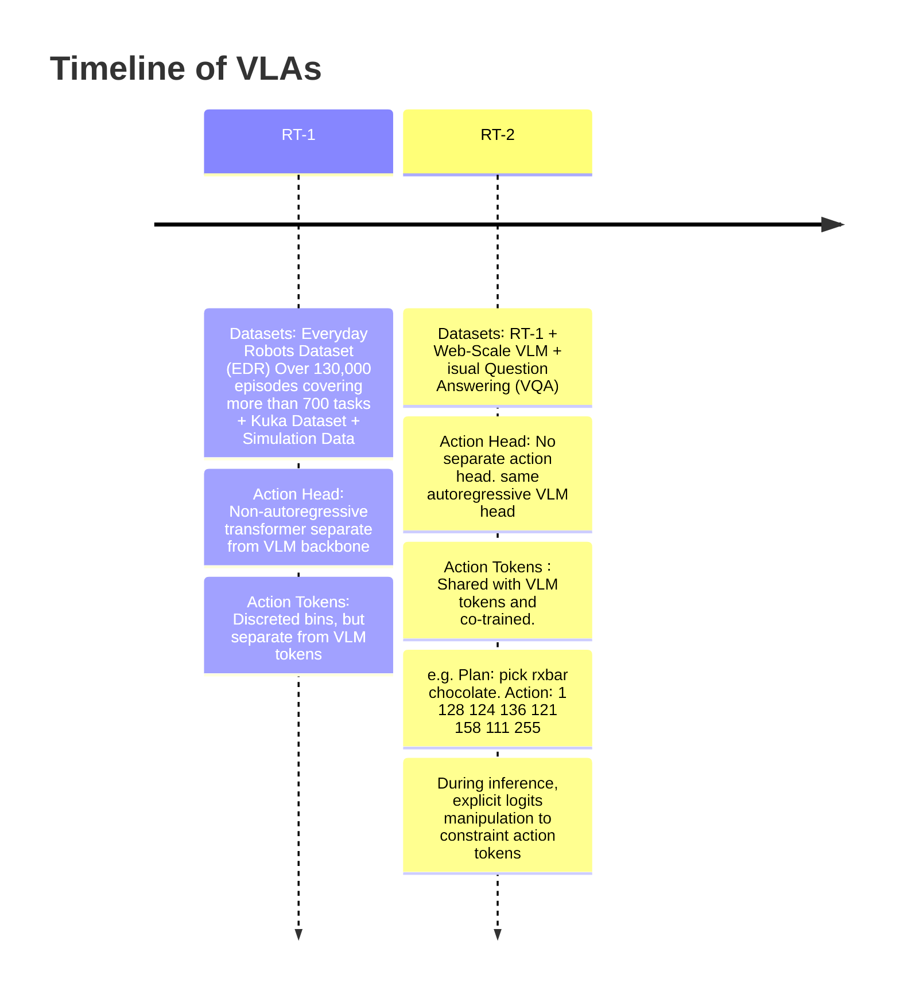

### Introduction

This post contains my personal notes on the π0.5 model from Physical Intelligence. Recently, I started working on a project that involved fine-tuning the π0.5 model for a robotic pick-and-place task. Vision language action models (VLAs) are quite complex, incorporating elements from various neural network and robotic paradigms, including large language models (LLMs), vision language models (VLMs), flow matching, autoregressive token prediction, tokenizers, short-horizon action generation, and long-horizon task planning, to name a few. This post covers all of these components in just enough depth to understand their usage in the π0.5 model. Since my project focuses on fine-tuning the model on a UR5 arm fitted with a two-finger Robotiq gripper, I spent a lot of time working with the π0.5 version open-sourced by Physical Intelligence. As a result, I will highlight the differences between the full model described in the paper and the slightly limited open-source release.

⚠️ <b>This is a living document</b>

### Timeline

I will start this section with a big disclaimer. The timeline presented does not reflect the actual history of VLAs. For example, I am glossing over many significant VLAs. [This repository](https://github.com/yueen-ma/awesome-vla) does a great job of keeping track of the full VLA history and current developments. Instead, the timeline I present covers the models and datasets that were significant evolutionary steps in the creation of the π0.5 model.

π0.5 is undoubtedly a significant advancement in robotics, particularly for long-horizon tasks. While π0.5 incorporates many innovations, it also borrows heavily from the models depicted above. The RT1 and RT2 models can be seen as the early precursors to the π family of models. RT1 architecturally resembles most VLM architectures. In fact, up until the transformer block that generates action tokens, there are no differences from any generic VLM model at all. It tokenizes multimodal inputs and generates embeddings that encapsulate all information contained in the inputs using self-attention. This part is the same as any encoder module in LLMs/VLMs. However, unlike LLMs/VLMs, RT1 does not have a cross-attention-based decoder that autoregressively generates the next output token. Instead, it uses an action token generation transformer module that generates 11-dimensional action tokens corresponding directly to the control commands. This is also the major robotics-specific architectural innovation introduced by RT1. Robotic actions are continuous control commands. LLMs/VLMs are trained with discrete tokens using cross-entropy loss. RT1 stuck with the same discrete tokens and the same training scheme by discretizing continuous control commands into discrete bins. Here is an excerpt from the RT1 paper explaining the process.

<b><em>❝ To tokenize actions, each action dimension in RT-1 is discretized into
256 bins. As mentioned previously, the action dimensions we consider include seven variables
for the arm movement (x, y, z, roll, pitch, yaw, opening of the gripper), three variables for base
movement (x, y, yaw) and a discrete variable to switch between three modes: controlling arm, base
or terminating the episode. For each variable, we map the target to one of the 256 bins, where the
bins are uniformly distributed within the bounds of each variable. ❞</em></b>

RT1 aimed for 3HZ control frequency, which means the inference time of RT1 should take less than 100ms.

<b><em>❝ The two VLMs that we finetune in our experiments, PaLI-X and PaLM-E, use
different tokenizations. For PaLI-X, integers up to 1000 each have a unique token, so we simply
associate the action bins to the token representing the corresponding integer. For the PaLM-E model,
which does not provide this convenient representation of numbers, we simply overwrite the 256 least
frequently used tokens to represent the action vocabulary. 
❞</em></b>

    

        
    

Co-training tasks in π0.5. Source: <a href="https://www.pi.website/blog/pi05"> Physical Intelligence π0.5 blog</a> 

    

        
    

High-level/low-level inference procedure used by π0.5. Source: <a href="https://www.pi.website/blog/pi05"> Physical Intelligence π0.5 blog</a> 

    

        
    

   System 2 + System 1 design. Source: <a href="https://robot-learning-collective.github.io/winning-behavior-1k-challenge.html"> Ilia Larchenko</a> 

**SigLIP**

CLIP (Contrastive Language–Image Pretraining), introduced by OpenAI, is a model that learns visual representations by aligning images and text in a shared embedding space. It is trained on large-scale image-text pairs using a symmetric cross-entropy loss over cosine similarities. Given a batch of N image-text pairs, CLIP computes a similarity matrix and maximizes the similarity of correct pairs while minimizing incorrect ones. The loss for images is:

$$
    \mathcal{L}_{\text{CLIP}} = -\frac{1}{N} \sum_{i=1}^{N} \log
    \frac{\exp(\text{sim}(\mathbf{v}_i, \mathbf{t}_i) / \tau)}
         {\sum_{j=1}^{N} \exp(\text{sim}(\mathbf{v}_i, \mathbf{t}_j) / \tau)}
$$

where $\text{sim}(⋅,⋅)$ denotes cosine similarity and $\tau$ is a learnable temperature parameter. The total loss is the average of the image-to-text and text-to-image directions.

SigLIP (Sigmoid Loss for Language–Image Pretraining), introduced by Google, replaces CLIP's softmax-based contrastive loss with a sigmoid loss, treating each image-text pair independently as a binary classification problem. This removes the dependency on in-batch negatives and allows more stable training with smaller batch sizes. The SigLIP loss is defined as:

$$
\mathcal{L}_{\text{SigLIP}} = -\frac{1}{N^2} \sum_{i=1}^{N} \sum_{j=1}^{N}
    \log \sigma\!\left(z_{ij} \cdot \left(2 \cdot \mathcal{1}[i=j] - 1\right)\right)
$$

where $\sigma(⋅)$ is the sigmoid function, $ z\_{ij} = \text{sim} (v_i, v_j)/ \tau $ is the scaled similarity score, and $\mathcal{1}[i=j]$ is 1 for positive pairs and 0 for negatives. This formulation encourages positive pairs to have high sigmoid outputs and negative pairs to have low ones, independently of one another.

**Action Tokenization**

**Action Expert**

**Flow matching**


Source: <a href="https://peterroelants.github.io/posts/flow_matching_intro">Peter Roelants' excellent blog</a>

Diffusion models and flow matching are two powerful frameworks for generative modeling that learn to transform a simple noise distribution into a complex data distribution. Diffusion models operate by defining a forward process that gradually corrupts data $x_0$ with Gaussian noise over $T$ timesteps, and then learning a reverse process to denoise it. The forward process is defined as:

$$
    q(\mathbf{x}_t | \mathbf{x}_0) = \mathcal{N}\!\left(\mathbf{x}_t;\,
    \sqrt{\bar{\alpha}_t}\,\mathbf{x}_0,\, (1 - \bar{\alpha}_t)\mathbf{I}\right)

$$

where $\bar{\alpha}_t$ is a Cumulative signal retention factor (how much of the original signal $\mathbf{x}_0$ is retained at time $t$). The model is trained to predict the noise ϵ added at each step via:

$$

    \mathcal{L}_{\text{diff}} = \mathbb{E}_{t,\, \mathbf{x}_0,\, \boldsymbol{\epsilon}}
    \left[\|\boldsymbol{\epsilon} - \boldsymbol{\epsilon}_\theta(\mathbf{x}_t, t)\|^2\right]

$$

Flow matching instead learns a vector field $\mathbf{v}_\theta(\mathbf{x}, t)$ governed by an ODE:

$$

    \frac{d\mathbf{x}}{dt} = \mathbf{v}_\theta(\mathbf{x}, t)

$$

with linear interpolation $\mathbf{x}_t = (1-t)\,\mathbf{x}_0 + t\,\mathbf{x}_1$
and trained using the Conditional Flow Matching objective:

$$

    \mathcal{L}_{\text{CFM}} = \mathbb{E}_{t,\, \mathbf{x}_0,\, \mathbf{x}_1}
    \left[\|\mathbf{v}_\theta(\mathbf{x}_t, t) - (\mathbf{x}_1 - \mathbf{x}_0)\|^2\right]

$$

During inference, flow matching generates samples by numerically solving an ODE that transports a noise sample from the source distribution $p_0$ to the data distribution $p_1$. Since we cannot solve this ODE analytically, we use Euler integration — one of the simplest numerical ODE solvers — to approximate the solution step by step.

Step 1: Start with a noise sample drawn from the source distribution:

$$
\mathbf{x}_0 \sim p_0 = \mathcal{N}(\mathbf{0}, \mathbf{I})
$$

Step 2: Define a uniform time grid with $N$ steps between $t=0$ and $t=1$:

$$
\Delta t = \frac{1}{N}, \quad t_n = \frac{n}{N}, \quad n = 0, 1, \dots, N-1
$$

Step 3: At each timestep $t_n$, query the learned vector field and take a small Euler step

$$
\mathbf{x}_{t_{n+1}} = \mathbf{x}_{t_n} + \Delta t \cdot \mathbf{v}_\theta(\mathbf{x}_{t_n}, t_n)
$$

Step 4: After $N$ steps, the final sample $\mathbf{x}_1$ is the generated data point:

$$
\mathbf{x}_1 \approx \mathbf{x}_0 + \sum_{n=0}^{N-1} \Delta t \cdot \mathbf{v}_\theta(\mathbf{x}_{t_n}, t_n)
$$

**Long-Horizon Tasks**

**FAST Tokenization**

$$
$$
